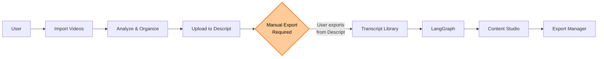
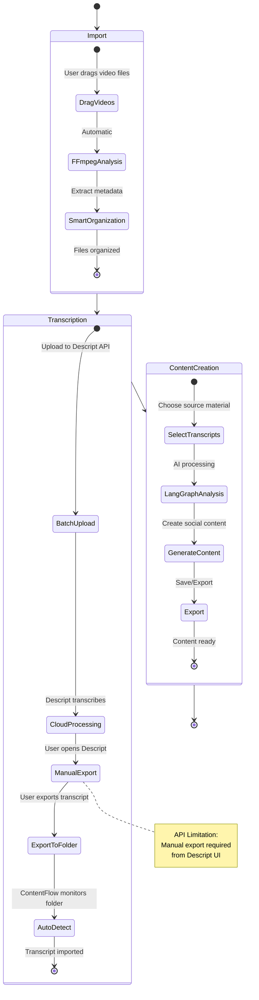

Project: ContentFlow - AI-Powered Content Creation Studio
Version: 1.0
Date: January 7, 2025
Author: ContentFlow Architecture Team
1. Introduction
The High-Level Design (HLD) for ContentFlow provides the technical blueprint for an intelligent macOS desktop application that automates the entire content creation workflow from video file ingestion to social media-ready content. This document describes the system's major components, their interactions, and the underlying technologies that enable seamless integration between file management, transcript processing, and AI-powered content generation.
ContentFlow addresses the fragmented workflow that content creators face when managing video files, extracting transcripts, and repurposing spoken content into various social media formats. The architecture leverages macOS-specific capabilities and Tauri's efficient runtime for a native desktop experience.
2. Architectural Goals and Drivers
The architectural decisions for ContentFlow are driven by the following requirements and constraints:
Primary NFR Drivers:

Performance: Real-time file analysis with sub-second UI response times
Reliability: Graceful handling of external API failures (Descript, AI services)
User Experience: Native macOS look and feel with smooth animations
Simplicity: Streamlined workflow focusing on core functionality

Technical Constraints:

Must integrate with Descript API for transcription services
Must use LangGraph for workflow orchestration (project requirement)
macOS-only deployment (10.15 Catalina or higher)
Requires active internet connection for API services

Business Constraints:

4-day development timeline
Focus on solving personal content creation workflow problems
Emphasis on automation over manual configuration

3. Architectural Overview & Context Diagram
ContentFlow follows a Simplified Event-Driven Architecture with clear separation between the Rust backend (system operations) and React frontend (user interface), connected via Tauri's IPC bridge.
Context Diagram:

```mermaid
graph TB
    subgraph "ContentFlow System (macOS)"
        IM[Import & Organize]
        TL[Transcript Library]
        CS[Content Studio]
        DI[Descript Integration]
        LG[LangGraph Workflows]
        EM[Export Manager]
        
        IM --> TL
        TL --> CS
        IM --> DI
        TL --> LG
        CS --> EM
    end
    
    subgraph "External Services"
        DAPI[Descript API]
        AI[OpenAI/Claude]
    end
    
    subgraph "User Actions"
        ME[Manual Export from Descript]
    end
    
    UF[User Files<br/>(~/Content)] --> IM
    DI -->|Upload Files| DAPI
    DAPI -.->|Requires Manual Export| ME
    ME -->|Export to Folder| TL
    LG --> AI
    EM --> UF
    
    style ME fill:#ff9999,stroke:#ff0000,stroke-width:2px
    style DAPI fill:#ffcc99,stroke:#ff6600,stroke-width:2px
```
4. Component Breakdown and Interaction
Simplified Component Architecture:
ContentFlow.app
├── Frontend (React + TypeScript)
│   ├── Screens
│   │   ├── FileManager.tsx
│   │   ├── OrganizationHub.tsx
│   │   ├── TranscriptLibrary.tsx
│   │   ├── ContentStudio.tsx
│   │   └── Settings.tsx
│   └── State (Zustand)
│
├── Tauri Bridge
│   ├── File Commands
│   ├── API Commands
│   └── Workflow Commands
│
├── Backend (Rust)
│   ├── File Operations
│   │   ├── Media Analysis (FFmpeg)
│   │   └── File Organization
│   ├── Database (SQLite)
│   └── API Clients
│       ├── Descript
│       └── AI Services
│
└── Workflows (LangGraph)
    ├── Transcript Analysis
    ├── Content Generation
    └── Multi-Source Processing
Core Component Responsibilities:

File Manager (Rust)

Drag-and-drop file import
FFmpeg analysis for video metadata
Smart organization by date/orientation/type


Descript Integration (Rust)

Batch upload to Descript projects via API
Monitor designated export folder for manually exported transcripts
Automatic import when transcript files are detected
Note: Due to API limitations, transcripts must be manually exported from Descript


LangGraph Orchestration (JavaScript)

Transcript analysis workflows
Multi-transcript content generation
Template-based content structuring


Content Studio (React)

Interactive content editor
Template selection and customization
Real-time preview and editing


Simplified Interaction Flow:


5. Data Architecture Overview
Streamlined Data Storage:

SQLite Database: All application data in a single file
File System: ~/Library/Application Support/ContentFlow/

Organized video files
Exported content
Templates and settings


Core Database Schema:
sql-- Simplified schema focusing on essentials
CREATE TABLE files (
    id TEXT PRIMARY KEY,
    path TEXT NOT NULL,
    orientation TEXT,
    duration REAL,
    created_at DATETIME,
    status TEXT
);

CREATE TABLE transcripts (
    id TEXT PRIMARY KEY,
    file_id TEXT,
    content TEXT,
    tags TEXT, -- JSON array
    created_at DATETIME,
    FOREIGN KEY (file_id) REFERENCES files(id)
);

CREATE TABLE generated_content (
    id TEXT PRIMARY KEY,
    transcript_ids TEXT, -- JSON array
    template_type TEXT,
    content TEXT, -- JSON structure
    created_at DATETIME
);
6. Deployment View
macOS Application Structure:
ContentFlow.app/
├── Contents/
│   ├── MacOS/
│   │   └── contentflow (Rust binary)
│   ├── Resources/
│   │   ├── icon.icns
│   │   └── web assets
│   └── Info.plist
│
~/Library/Application Support/ContentFlow/
├── contentflow.db (SQLite)
├── organized/
│   └── 2025/
│       └── 01/
│           ├── horizontal/
│           └── vertical/
└── exports/
Runtime Architecture:
macOS System
├── ContentFlow.app
│   ├── Tauri Runtime (WKWebView)
│   ├── React UI
│   └── Rust Backend
│
├── External Services
│   ├── Descript API (HTTPS)
│   ├── OpenAI API (HTTPS)
│   └── Claude API (HTTPS)
│
└── User Data
    ├── Video Files (~/Movies/ContentFlow)
    ├── Database (~/Library/Application Support/ContentFlow)
    └── Exports (~/Documents/ContentFlow Exports)
Key macOS Integrations:

Native file dialogs via macOS APIs
Dock badge for background progress
macOS notifications for workflow completion (including when manual Descript export is needed)
Quick Look preview support
Native menu bar with keyboard shortcuts
File system watcher for Descript export folder monitoring

Simplified Workflow Execution:



Key Points:
1. **Import Phase**: Fully automated - User drags videos → FFmpeg analysis → Smart organization

2. **Transcription Phase**: 
   - Automated: Batch upload to Descript via API
   - Manual Step: User must export transcripts from Descript UI (API limitation)
   - Automated: ContentFlow detects exported files and imports them

3. **Content Creation Phase**: Fully automated - Select transcripts → LangGraph analysis → Generate content → Export

⚠️ **Important**: Due to Descript API limitations, the transcription phase requires manual intervention. The API can only upload files; transcript export must be done manually through the Descript application.
This streamlined architecture focuses on delivering a smooth, macOS-native experience while maintaining the intelligent workflow automation that makes ContentFlow powerful. The simplified approach ensures feasibility within the 4-day timeline while solving real content creation workflow problems.